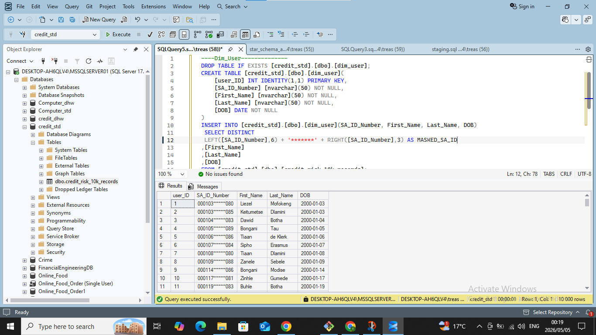

# credit_risk_project

​📌 Project Overview

​This project demonstrates a robust Data Engineering pipeline built to handle sensitive credit risk data. The pipeline moves raw, inconsistently formatted Excel data through a staging environment into a secure, normalized Star Schema in SQL Server.
​Key highlights include PII masking for South African ID numbers, automated ETL via Stored Procedures, and complex data type transformations to handle currency and financial metrics.

​🛠️ Technical Challenges & Solutions

​1. The "Input String" Formatting Error

​During the initial ingestion phase using the SSMS Import Wizard, the process failed due to data type mismatches. South African ID numbers (13 digits) and currency fields with specific decimal formatting caused the standard import to crash.

​Error Encountered: “Input string was not in a correct format.”

​The Solution: I shifted from a direct import to an ELT (Extract, Load, Transform) pattern. I created a Staging Table where all columns were set to NVARCHAR(50). 

This acted as a "safety net," allowing the raw data to land in SQL Server before applying strict data types.

​2. Data Transformation & PII Masking

​Once the raw data was in Staging, I developed transformation logic to convert text-based currency into FLOAT types and implemented Hard Masking for the SA_ID_Number to comply with data privacy standards (POPIA).
​Masking Logic: LEFT(SA_ID, 6) + '*******' + RIGHT(SA_ID, 3)

​Result: Protected user identities while keeping birth-date utility (first 6 digits).

​📐 Data Architecture (Star Schema)

​The final architecture follows a Star Schema design to optimize for analytical reporting. By separating categorical data into Dimensions, the Fact table remains lean and efficient.

​Fact Table: Fact_Credit (Contains transactional loan data and financial metrics).

​Dimension Tables: Dim_User, Dim_Location, Dim_Employment_Status, Dim_Gender, Dim_Risk_Rating.

​🚀 Automation & Repository Structure

​To ensure the pipeline is repeatable and professional, I encapsulated the transformation logic into Stored Procedures.
​Folder Structure

├── raw_data/            # Original Excel/CSV source files

├── sql/                 # Staging and general scripts

├── dim_&_fact_tables/   # DDL for Star Schema architecture

├── stored_procedure/    # ETL automation logic

└── images/              # Documentation assets

Commit History
​The development process followed a clean, modular approach, moving from initial fixes to security implementation and final automation.

​🔧 Tools Used

​SQL Server Management Studio (SSMS): Database Engine & T-SQL development.

​Draw.io: Star Schema conceptual design.

​Git/GitHub: Version control and documentation.

​Excel: Source data inspection.

​How to Run

​Execute the scripts in the sql/ folder to create the staging area.

​Run the DDL scripts in dim_&_fact_tables/ to build the Star Schema.

​Execute the procedures in stored_procedure/ to transform and load the data.
