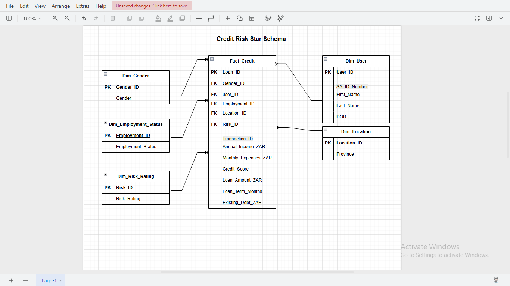
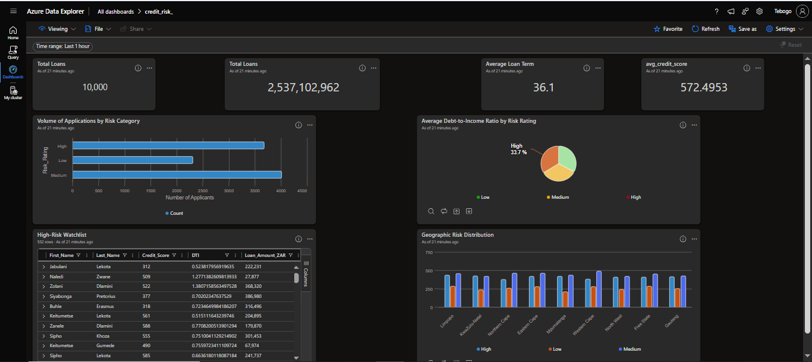

# Credit Risk Analytics Project

A comprehensive **Data Engineering pipeline** for analyzing South African credit risk data, featuring ETL automation, PII protection, and interactive analytics dashboards.

---

## 📋 Table of Contents

- [Project Overview](#project-overview)
- [Architecture](#architecture)
- [Key Features](#key-features)
- [Technical Challenges & Solutions](#technical-challenges--solutions)
- [Repository Structure](#repository-structure)
- [Setup & Execution](#setup--execution)
- [Tools & Technologies](#tools--technologies)
- [Data Schema](#data-schema)
- [Dashboard](#dashboard)

---

## 🎯 Project Overview

This project demonstrates a **production-ready Data Engineering pipeline** built to process and analyze credit risk datasets while maintaining strict data privacy compliance. The pipeline handles:

- **10,000+ credit risk records** from raw CSV sources
- **Sensitive PII masking** for South African ID numbers
- **Automated ETL transformations** via SQL Server stored procedures
- **Star schema design** optimized for analytical reporting
- **Interactive dashboards** in Azure Data Explorer for business insights

**Business Value**: Transforms raw, inconsistent credit data into a clean, secure, and queryable data warehouse supporting risk analysis and decision-making.

---

## 🏗️ Architecture

### Design Pattern: **ELT (Extract, Load, Transform)**

```
Raw Data (CSV)
    ↓
[Staging Tables - All NVARCHAR(50)]
    ↓
[Data Transformation & Validation]
    ↓
[Star Schema - Dimensions & Facts]
    ↓
[Azure Data Explorer Dashboards]
```

### Data Flow

1. **Extract**: Raw credit data imported from CSV files
2. **Load**: Lands in SQL Server staging tables with flexible data types
3. **Transform**: Stored procedures apply business logic, PII masking, and type conversions
4. **Analyze**: Star schema enables efficient reporting and dashboarding

---

## ✨ Key Features

### 1. **Data Privacy & Security**
- Hard masking of South African ID numbers: `LEFT(SA_ID, 6) + '*******' + RIGHT(SA_ID, 3)`
- Preserves birth date utility (first 6 digits) while protecting identity
- Compliant with data protection regulations

### 2. **Robust ETL Automation**
- 6 stored procedures handling dimension and fact table population
- Automated data type conversions (text → FLOAT for currency)
- Reusable, version-controlled SQL scripts

### 3. **Star Schema Design**
- Optimized for OLAP analytical queries
- Lean fact tables linked to rich dimension tables
- Query performance and maintainability

### 4. **Interactive Analytics**
- Azure Data Explorer dashboards for real-time insights
- Risk distribution analysis
- Customer and location-based reporting
- Exportable JSON dashboard definitions

---

## 🔧 Technical Challenges & Solutions

### Challenge 1: **"Input String Was Not in a Correct Format"**

**Problem**: Direct import via SSMS Import Wizard failed due to:
- South African ID numbers (13 digits) conflicting with numeric types
- Currency fields with inconsistent decimal formatting
- Mixed data types in source Excel files

**Solution**: 
Implemented an **ELT pattern** with a staging layer:
- Created `stg_credit_data` with all columns as `NVARCHAR(50)`
- Staging table acts as a "safety net" for raw data ingestion
- Transformation logic applied post-load in stored procedures

**Benefit**: Decouples extraction from validation, enabling robust error handling and data inspection.

---

### Challenge 2: **Data Type Transformations & PII Masking**

**Problem**: 
- Currency stored as text (e.g., "R 5,234.50")
- ID numbers need protection before analytics
- Multiple data formats requiring standardization

**Solution**:
- **Currency Conversion**: Parse text strings → convert to FLOAT for financial calculations
- **PII Masking**: Applied in `sp_dim_user` stored procedure
- **Validation**: Data quality checks before loading into fact/dimension tables

**Masking Implementation**:
```sql
MASKED_ID = LEFT(SA_ID, 6) + '*' * 7 + RIGHT(SA_ID, 3)
```

---

## 📁 Repository Structure

```
credit_risk_project/
├── README.md                              # This file
├── raw_data/
│   └── credit_risk_10k_records.csv        # Source dataset (10,000 records)
├── sql/
│   ├── staging.sql                        # Staging table creation script
│   └── star_schema_arch_structure.sql     # Star schema overview & relationships
├── dim_&_fact_tables/
│   ├── dim_user.sql                       # User dimension DDL
│   ├── dim_location.sql                   # Location/Province dimension DDL
│   ├── dim_gender.sql                     # Gender dimension DDL
│   ├── dim_employment_status.sql          # Employment status dimension DDL
│   ├── dim_risk_rating.sql                # Risk rating dimension DDL
│   └── fact_credit.sql                    # Credit transactions fact table DDL
├── stored_procedure/
│   ├── sp_dim_user.sql                    # Populate Dim_User with PII masking
│   ├── sp_dim_location.sql                # Populate Dim_Location
│   ├── sp_dim_gender.sql                  # Populate Dim_Gender
│   ├── sp_dim_employment_status.sql       # Populate Dim_Employment_Status
│   ├── sp_dim_risk_rating.sql             # Populate Dim_Risk_Rating
│   └── sp_fact_credit.sql                 # Populate Fact_Credit
├── csv_files/
│   ├── dim_user.csv                       # Transformed user dimension (with masked IDs)
│   ├── dim_location.csv                   # Location dimension data
│   ├── dim_gender.csv                     # Gender dimension data
│   ├── dim_employment_status.csv          # Employment status dimension data
│   ├── dim_risk_rating.csv                # Risk rating dimension data
│   └── fact_credit.csv                    # Credit facts data
├── credit_dashboard/
│   └── [Dashboard files & configs]
├── images/
│   ├── dim_user.png                       # Sample of masked user dimension
│   ├── credit_schema.png                  # Star schema ER diagram
│   └── credit_dashboard.png               # Dashboard preview
└── .gitignore
```

---

## 🚀 Setup & Execution

### Prerequisites
- **SQL Server Management Studio (SSMS)** 2019 or later
- **Azure Data Explorer** account (for dashboarding)
- **Git** for version control

### Step 1: Create Staging Environment
```sql
-- Execute script to create staging tables
exec sql/staging.sql
```
*This creates a flexible staging table accepting all NVARCHAR data.*

### Step 2: Import Raw Data
```sql
-- Import credit_risk_10k_records.csv into stg_credit_data
-- Use SSMS Import Wizard or BULK INSERT
BULK INSERT stg_credit_data
FROM 'path/to/credit_risk_10k_records.csv'
WITH (FORMAT = 'CSV', FIRSTROW = 2, FIELDTERMINATOR = ',');
```

### Step 3: Build Star Schema
Execute DDL scripts in order:
```sql
-- Dimension tables
exec dim_&_fact_tables/dim_user.sql
exec dim_&_fact_tables/dim_location.sql
exec dim_&_fact_tables/dim_gender.sql
exec dim_&_fact_tables/dim_employment_status.sql
exec dim_&_fact_tables/dim_risk_rating.sql

-- Fact table
exec dim_&_fact_tables/fact_credit.sql
```

### Step 4: Populate Data via Stored Procedures
Execute in order (respects foreign key dependencies):
```sql
exec sp_dim_gender
exec sp_dim_employment_status
exec sp_dim_location
exec sp_dim_risk_rating
exec sp_dim_user              -- Applies PII masking here
exec sp_fact_credit           -- Populates transactional data
```

### Step 5: Export to Azure Data Explorer
1. Verify data in SQL Server tables
2. Export dimension and fact CSVs from the `csv_files/` folder
3. Import into your Azure Data Explorer cluster
4. Load the dashboard JSON definition from `credit_dashboard/`

---

## 🛠️ Tools & Technologies

| Component | Technology | Purpose |
|-----------|-----------|---------|
| **Database Engine** | SQL Server 2019+ | Data storage & transformation |
| **Development IDE** | SQL Server Management Studio (SSMS) | Query authoring & debugging |
| **ETL Orchestration** | SQL Server Stored Procedures | Automated data pipeline |
| **Analytics Platform** | Azure Data Explorer (KQL) | Real-time dashboarding & analysis |
| **Diagramming** | Draw.io | Schema architecture visualization |
| **Version Control** | Git/GitHub | Code and documentation management |
| **Source Data** | CSV/Excel | Input datasets |

---

## 📊 Data Schema

### Star Schema Design

**Fact Table: `Fact_Credit`**
- Core transactional data (loan records, amounts, dates)
- Foreign keys to all dimension tables
- Optimized for fast aggregations

**Dimension Tables:**
- **`Dim_User`**: Customer profiles (with masked SA_ID)
- **`Dim_Location`**: Geographic attributes (Province, Region)
- **`Dim_Gender`**: Gender categorization
- **`Dim_Employment_Status`**: Employment classification
- **`Dim_Risk_Rating`**: Risk level categorization

### Key Relationships
```
Fact_Credit
├── User_ID → Dim_User
├── Location_ID → Dim_Location
├── Gender_ID → Dim_Gender
├── Employment_Status_ID → Dim_Employment_Status
└── Risk_Rating_ID → Dim_Risk_Rating
```

### Sample Visualization


---

## 📈 Dashboard

An interactive **Azure Data Explorer dashboard** provides business intelligence on credit risk metrics.

**Dashboard Features:**
- Risk distribution by province and employment status
- Customer demographics and credit exposure
- Trend analysis and KPI tracking
- Export-ready visualizations

### Dashboard Preview


### Import Dashboard
The dashboard JSON export is available at: `credit_dashboard/dashboard-Copy of credit_risk_.json`

To import:
1. Open Azure Data Explorer
2. Go to **Dashboards** → **Create new dashboard**
3. Select **Import from file**
4. Upload the JSON file
5. Configure your KQL database connection

---

## 📝 Key Insights

✅ **PII Protection**: All South African ID numbers are securely masked before any analytics  
✅ **Scalability**: ELT pattern supports incremental loads and growing data volumes  
✅ **Data Quality**: Staging layer enables validation and error handling  
✅ **Automation**: Stored procedures ensure consistent, repeatable transformations  
✅ **Analytics Ready**: Star schema optimizes for business reporting and dashboards  

---

## 🤝 Contributing

Improvements welcome! Areas for enhancement:
- Incremental load logic (CDC - Change Data Capture)
- Data quality monitoring and alerting
- Performance tuning for larger datasets
- Additional risk metrics and KPIs

---

## 📄 License

This project is provided as-is for portfolio and educational purposes.

---

## 📧 Questions?

For questions about this project, feel free to open an issue or check the documentation in each folder.

**Happy analyzing! 📊**
